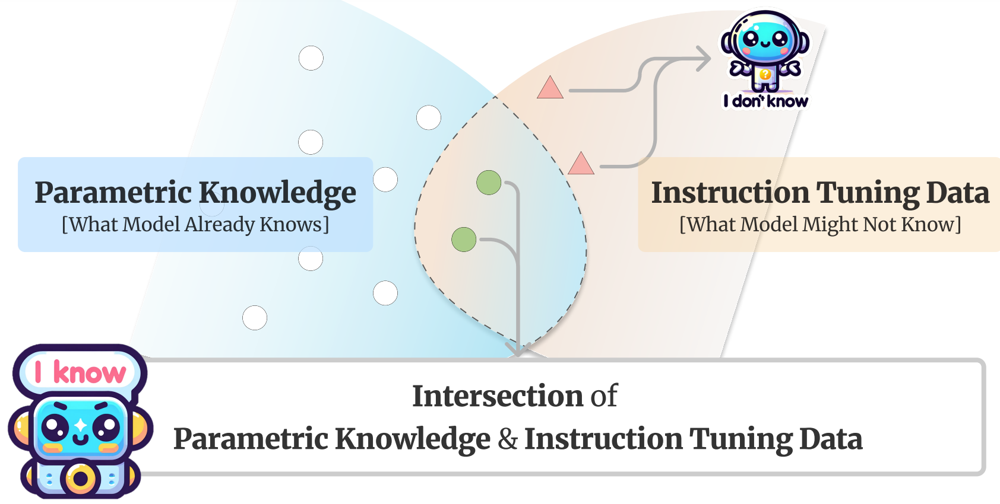
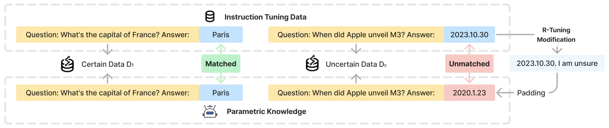

#   R-Tuning: Teaching Large Language Models to Say 'I Don't Know'

🏆 R-Tuning receives the **Outstanding Paper Award** at **NAACL 2024**. 🎉 

This is the official repo for the NAACL 2024 paper [R-Tuning: Instructing Large Language Models to Say 'I Don't Know'](https://arxiv.org/abs/2311.09677).


## Introduction 
A predominant issue of Large language models (LLMs) is the propensity to generate non-existent facts, a concern termed *hallucination*.
Our research is motivated by the observation that previous instruction tuning methods force the model to complete a sentence no matter whether the model knows the knowledge or not.
When the question is out of the parametric knowledge, it will try to make up something and fail to indicate when it lacks knowledge.
We present a new approach called **R**efusal-Aware Instruction **Tuning** (**R-Tuning**). 
This approach is formalized by first identifying the disparity in knowledge encompassed by pre-trained parameters compared to that of instruction tuning data.
Then, we construct the refusal-aware data based on the knowledge intersection, to tune LLMs to refrain from responding to questions beyond its parametric knowledge. 
Experimental results demonstrate **R-Tuning** effectively improves a model's ability to answer known questions and refrain from answering unknown questions.
Furthermore, when tested on out-of-domain datasets, the refusal ability was found to be a meta-skill that could be generalized to other tasks.
Further analysis surprisingly finds that learning the uncertainty results in better calibration and an improved ability to estimate the uncertainty than uncertainty-based testing.

The illustrations are shown below.

<p align="center">
 

</p>


## Getting Start

```bash
git clone https://github.com/hanningzhang/R-Tuning-code.git
cd R-Tuning-code
```

## Dataset Download

Please download the datasets from the link and put the folder inside the `R-Tuning-code/dataset` folder.
```bash
https://drive.google.com/drive/folders/17v7IbnAPXX1NQpqjlDMhhxFK0cuNYSd6?usp=sharing
```

## Requirements

```bash
git clone -b v0.0.5 https://github.com/OptimalScale/LMFlow.git
cd LMFlow
conda create -n lmflow python=3.9 -y
conda activate lmflow
conda install mpi4py
bash install.sh
cd ..
```
The `LMFlow` environment contains all the packages needed.

## Constructing Training Datasets

Here we provide 5 training datasets we use. Please change the directory and run codes to get the refusal-aware datasets.

We provide an example of running `ParaRel` dataset with `open_llama_3b` model. Other datasets are exactly the same.

```bash
cd training
cd pararel
python run_pararel.py \
--model openlm-research/open_llama_3b \
--method unsure
```

The constructed datasets will be stored in a new directory `training_data`

## Fine-tuning with LMFlow

Here is an example to finetune a `open_llama_3b` base model

Please feel free to replace `--model_name_or_path` with other HuggingFace models
```sh
cd ~/LMFlow
./scripts/run_finetune.sh \
  --model_name_or_path openlm-research/open_llama_3b \
  --dataset_path ../training/training_data \
  --output_model_path output_models/finetuned_llama_3b
```

## Evaluation

Here is an example to evaluate the `open_llama_3b` model on 'ParaRel' dataset.

Please replace `--model` with any R-Tuning models.
```sh
cd ~/evaluation/pararel
python evaluate.py \
--model openlm-research/open_llama_3b \
--domain ID \
--result ParaRel_openllama_3b
```

After receiving the result, please run the following command for Average Precision (AP) score evaluation:
```sh
cd results
python calculate_ap.py --result ParaRel_openllama_3b.json
```

## Citation

If you use or extend our work, please cite the following [paper](https://arxiv.org/abs/2311.09677):
```
@inproceedings{zhang-etal-2024-r,
    title = "{R}-Tuning: Instructing Large Language Models to Say {`}{I} Don{'}t Know{'}",
    author = "Zhang, Hanning  and
      Diao, Shizhe  and
      Lin, Yong  and
      Fung, Yi  and
      Lian, Qing  and
      Wang, Xingyao  and
      Chen, Yangyi  and
      Ji, Heng  and
      Zhang, Tong",
    editor = "Duh, Kevin  and
      Gomez, Helena  and
      Bethard, Steven",
    booktitle = "Proceedings of the 2024 Conference of the North American Chapter of the Association for Computational Linguistics: Human Language Technologies (Volume 1: Long Papers)",
    month = jun,
    year = "2024",
    address = "Mexico City, Mexico",
    publisher = "Association for Computational Linguistics",
    url = "https://aclanthology.org/2024.naacl-long.394",
    pages = "7113--7139",
}
```
